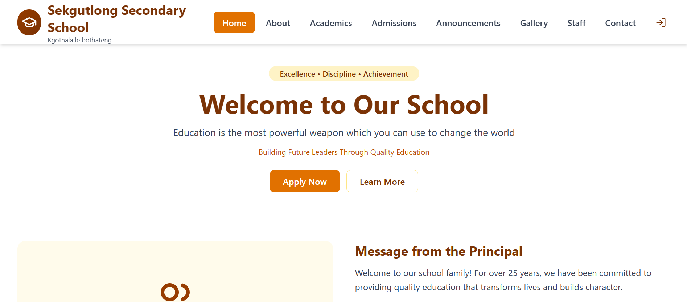
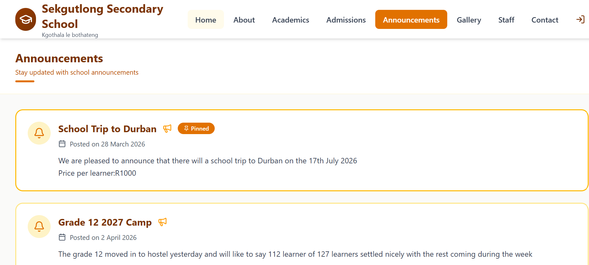
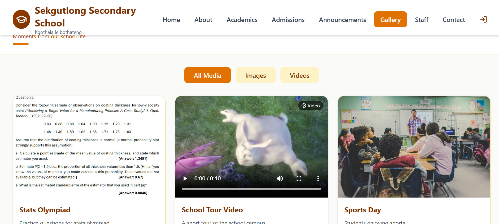
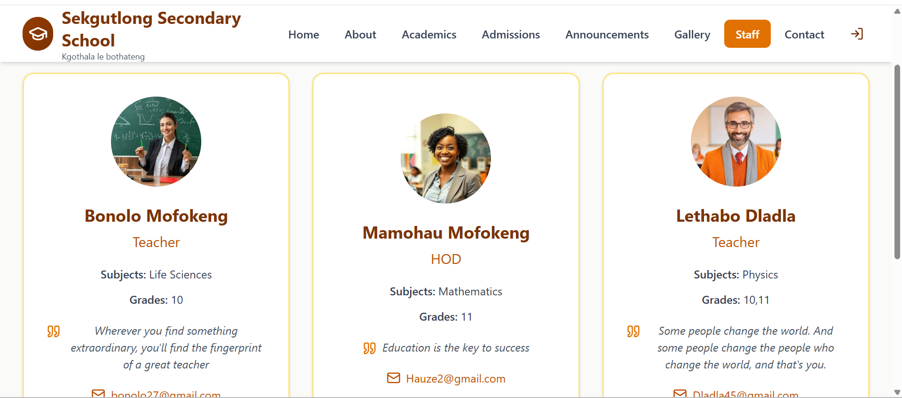
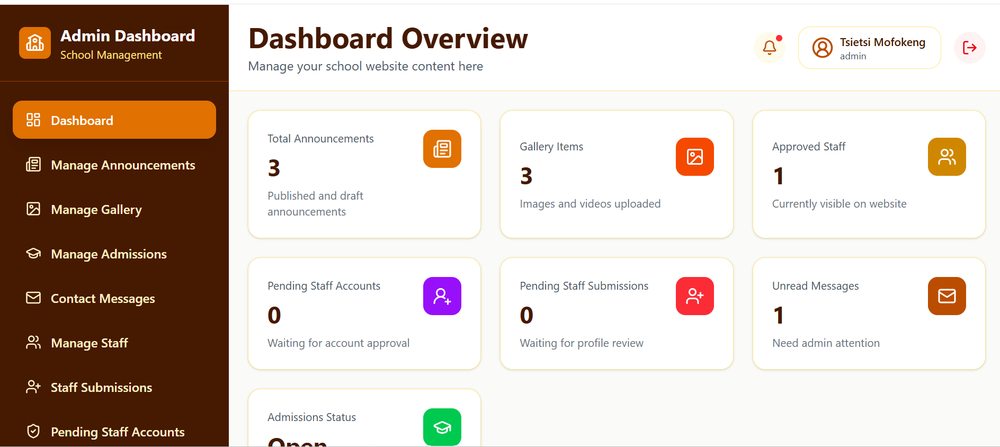
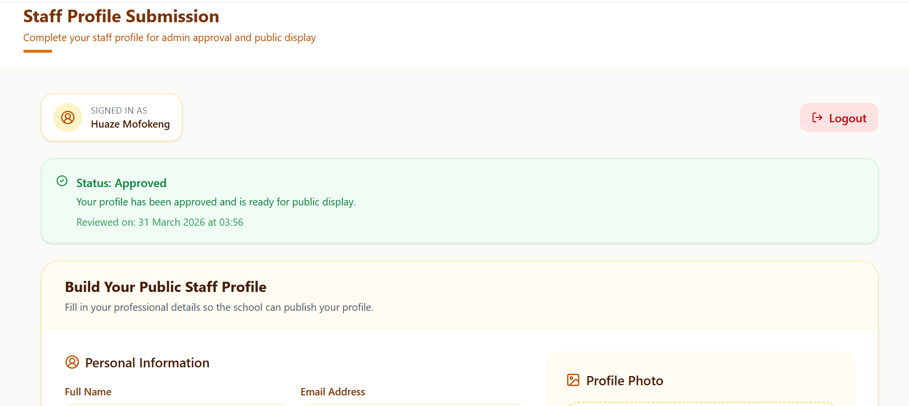

# 🎓 Sekgutlong School Website & Management System

  A modern full-stack platform designed to support real school operations, staff workflows, and public engagement.

  
  
  
  

---

## 🚀 Overview

The **Sekgutlong School Website & Management System** is a full-stack web application designed to streamline school operations while providing a clean and interactive public-facing platform.

It bridges the gap between **administration, staff, and the public**, enabling efficient communication, content management, and workflow automation.

---

## 🌍 Real-World Impact

This system was designed with the goal of being **deployed and used by Sekgutlong School** to improve administrative efficiency and communication.

It addresses real challenges such as:

- Managing announcements in one place  
- Streamlining staff profile submissions and approvals  
- Providing a centralized platform for students, parents, and staff  

This project demonstrates how software can be used to **solve practical problems in educational environments**.

---

## ✨ Key Features

### 🌐 Public Platform
- 📢 View announcements and updates  
- 🖼️ Browse media gallery (images & videos)  
- 👩‍🏫 Explore staff profiles  
- 📝 Access admissions information  
- 📩 Contact the school  

### 🔐 Admin Dashboard
- 🔑 Secure authentication system  
- 🛠️ Full CRUD for announcements  
- 🖼️ Manage gallery content  
- 👥 Staff management system  
- ✅ Approve/reject staff submissions  
- 📬 Manage contact messages  
- 📊 Dashboard statistics and insights  

### 👩‍🏫 Staff System
- 📝 Staff profile submission workflow  
- ⏳ Admin approval system (pending / approved / rejected)  
- 🖼️ Profile image upload with preview  
- 📍 Status tracking system  

---

## 🛠️ Tech Stack

| Layer        | Technology |
|-------------|------------|
| Frontend     | React (Vite), Tailwind CSS |
| Backend      | Supabase (Database, Auth, Storage) |
| UI/UX        | Lucide React Icons |
| Tools        | React Hot Toast |
| Versioning   | Git & GitHub |

---

## 📸 Screenshots

### 🏠 Home Page

  

### 📢 Announcements

  

### 🖼️ Gallery

  

### 👩‍🏫 Staff Page

  

### 🧑‍💼 Admin Dashboard

  

### 📝 Staff Profile Submission

  

---

## ⚙️ Installation & Setup

git clone https://github.com/Tsiika165/sekgutlong-school-website.git  
cd sekgutlong-school-website  
npm install  
npm run dev  

---

## 🌐 Future Improvements

- 🏫 Integrate Sekgutlong School branding and visuals for improved user experience  
- 🎨 Enhance UI/UX by incorporating real images of Sekgutlong School  
- 🖼️ Add a dynamic background featuring Sekgutlong School  
- 📱 Mobile application version for broader accessibility  
- 🔔 Real-time notifications for announcements and updates  
- 📈 Advanced analytics dashboard for admin insights  
- 🧠 AI-powered search and recommendations  
- 🌍 Multi-language support for inclusivity  

---

## 🤝 Contribution

Contributions are welcome!

1. Fork the repository  
2. Create your feature branch  
3. Commit your changes  
4. Open a pull request  

---

## 📄 License

This project is open-source and available under the MIT License.

---

## 👨‍💻 Author

**Tsietsi Mofokeng**

- 💼 Aspiring Software Engineer & Systems Developer  
- 🎓 BSc Computer Science  
- 🌍 Passionate about building real-world digital solutions  

> This project is part of my portfolio showcasing full-stack development, system design, and real-world problem solving.

---

  ⭐ If you like this project, consider giving it a star!

